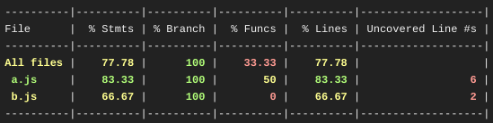

# Selective test execution

The goal of this project is to offer a solution to select the minimum subset of tests to execute, based on the code changes in a pull-request.

## JavaScript

State of the art: based on git status
https://dzone.com/articles/test-creep-selective-test

Issues with test-creep:
- based on a JSON file at the root of the project: `.testdeps_.json`
This can lead to merge issues if the files is added to GIT, if we are working on several branches in parallel.
Also, if the project is large, it will create heavy files updated very often, not ideal.
- based on GIT status: not working straight-away in the context of pull-requests

[More details](js/README.md)

## Java

[More details](java/README.md)